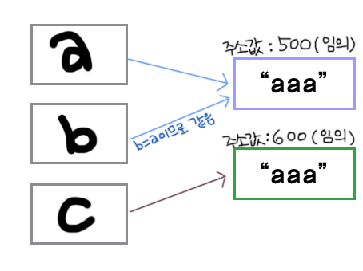

<div align="center" id="top">
<br>
  <h1>📃개념 및 궁금증 정리</h1>
</div>

***

## 웹 서버란?
* 클라이언트에게 HTML 문서나 각종 리소스를 응답을 전달해주는 역할.
* 서버 범위 중 클라이언트와 가장 맞닿아 있음.
* ex. Nginx, Apache


***
## WAS (Web application server)
* 웹 어플리케이션이 동작하도록 지원하는 목적을 가짐.
* 즉, 서비스 및 비즈니스 로직을 담고있는 서버.
* ex. Tomcat


***

## 절차지향과 객체지향
- 절차지향 : 프로그램의 실행 절차에 중점을 둔 프로그래밍의 일종
  - 장점 : 컴퓨터의 처리구조와 유사해 실행속도가 빠름
  - 단점 : 1. 코드의 수정이 어려움
           2. 유지보수가 어려움
  - 언어) C언어
- 객체지향 : 프로그램에서 다수의 "객체"를 만들고, 이들이 서로 상호작용을 통해 만들어지는 방식이다.
  - 장점 : 1.상속을 통해 프로그래밍시 코드의 재사용을 높일 수 있음
           2.프로그램 수정시 추가, 수정을 하더라도 캡슐화를 통해 주변 영향이 적기때문에 유지보수가 쉬움
  - 단점 : 캡슐화와 격리구조에 때문에 실행속도가 느리다.
  - 언어) Java, JavaScript, Python, C#

***
## 제너릭(Generic)이란?
* 데이터 형식에 의존하지 않고, 하나의 값이 여러 다른 데이터 타입들을 가질 수 있도록 하는 방법
* 제너릭을 사용하는 이유는?
  * 잘못된 타입이 들어올 수 있는 것을 컴파일 단계에서 방지할 수 있다. 
  * 타입을 체크하고 변환해줄 필요가 없어 관리가 편하다.
  * 코드의 재사용성이 높아진다.
```
ArrayList<String> list1 = new ArrayList<Integer>();
```


***

- <Value Type / Reference Type>
  - Value Type : 자신이 직접 데이터를 저장해서 보관
    - ex) int x  = 10; // int, char, double...
  - Reference Type : 데이터가 있는 위치만 자신이 가지고 있다가 필요할때 그 데이터가 있는 곳으로 가서 데이터를 가져옴
    - ex) Member mem = new Member(); // Class, Array, Interface..

***

- hashcode()
  - 객체의 주소값을 변환하여 생성한 객체의 고유한 정수값
    ```Javascript
          String str1 = new String("안녕");
          String str2 = new String("안녕");  
          String str3 = new String("하이");  
    ```
    str1과 str2는 객체는 달라도 hashcode는 동일 / str3은 다름

***

- <오버로딩 & 오버라이딩>
  - Overloading(오버로딩)
    - 같은 이름의 메소드 여러개 정의
    - 매개변수의 타입이나 개수가 다름
  - Overriding
    - 부모클래스의 메소드를 자식클래스에서 재정의

***

- Generics(제네릭)
  - 클래스나 메소드에서 사용할 내부 데이터 타입을 일반화하는것
  - ex) MyArray<Integer> myArr = new MyArray<Integer>();
    - 타입의 안정성 향상
    - 타입체크와 형변환을 생략할 수 있으므로 코드가 간결

***


***
  
- SimpleDateFormat
  - 시간을 원하는 방식으로 프린트 하기위한 클래스
  
문자 | 설명 | 예 |
-- | -- | - |
G | BC 혹은 AD | AD
y | 년도 | 1996; 96
M | 년 중 몇 번째 달인지 | July; Jul; 07
w | 년 중 몇 번째 주인지(Week in year) | 27
W | 월 중 몇 번째 주인지 (Week in month) | 2
D | 년 중 몇 번째 날인지 (Day in year) | 189
d | 이번 달 몇 번째 날인지 (Day in month) | 10
F | 이번 달, 이번 주에서 몇 번째 날인지 (Day of Week in month) | 2
E | 이번 주에서 몇 번째 날인지 (Day in week) | Tuesday; Tue
a | 오전/오후 (AM/PM marker) | PM
H | 하루 중 시각  (Hour in day) (0-23) | 0
k | 하루 중 시각  (Hour in day) (1-24) | 24
K | 오전/오후 시각 (Hour in am/pm) (0-11) | 0
h | 오전/오후 시각 (Hour in am/pm) (1-12) | 12
m | 분 (Minute in hour) | 30
s | 초 (second in minute) | 55
S | 밀리초 (Millisecond) | 978
z | 타임존 (General time zone) | Pacific Standard Time; PST; GMT-08:00
Z | 타임존 (RFC 822 time zone) | -0800
  
  
- GregorianCalendar
  - Calendar라는 클래스가 추상클래스로 선언되어있음
  - 지정한 날짜에 시간을 더할 때 GregorianCalendar 클래스 사용
  - 전체적으로 Date와 Calendar가 합쳐진 느낌
  
  
  
  
***

  
  
  
  
  
  
  
  
  
  
  
  
  
  
  
  
  
  
  
  
  
  
<div align="center" id="top">
  <h1> 📖Java Class</h1>
</div>
  
### StringBuffer
- 문자열을 변경하고자할때 사용하는 클래스
  - 특징 : append()로 문자열을 추가해나갈수 있다.
  - ex) StringBuffer buf = new StringBuffer("자바")
  - buf.append("공부")
  - 출력: 자바공부
- insert() 메소드
  - 설명 : StringBuffer클래스를 임포트 해야하며 문자열 사이에 특정 문자를 넣을때 사용된다.
  - StringBuffer str = new StringBuffer("자바 재밌다")
  - insert(2,"공부는") // 문자열 왼쪽부터 2번째에 "공부는"을 넣어준다.
  - 출력 : 자바공부는 재밌다.
  
### DriverManager
 * JDBC 드라이버들의 집합을 관리하는 기본적인 작업을 수행.
 * 데이터베이스 드라이버들을 로딩하고, 데이터베이스에 연결에 관해 책임지는 클래스.
 * 사용할 드라이버는 드라이버 매니져가 드라이버를 구동하기 전에 등록되어 있어야 함.
  
***


<div align="center" id="top">
  <h1> 📖Java 함수</h1>
</div>

### equals와 ==의 차이점
- equals () 
  - 메소드
  - 비교하고자 하는 대상의 내용 자체를 비교
- ==
  - 연산자
  - 비교하고자 하는 대상의 주소값을 비교
  
```
  <예시>
    String a = "aaa";
    String b = a;
    String c = new String ("aaa");
    
    System.out.println( a.equals(b)); // true
    System.out.println( a==b); // true
    System.out.println( a==c); // false
    System.out.println( a.equals(c)); // true
```
    
<br>
    

### 문자형 배열의 오름차순 & 내림차순
  - 오름차순 : Arrays.sort(배열변수명);
  - 내림차순 : Arrays.sort(배열변수명, Collections.reverseOrder());
  - 출력 : Arrays.toString(배열변수명)


  
  

  
- split
  - ex)split.str("@")
  - 설명 : str 문자열을 @별로 나누어 배열로 저장.
  
- substring
  설명 : 문자열을 자르는 함수
  - 활용 :  String.substring(start) //문자열  start위치부터 끝까지 문자열 자르기
  - String.substring(start,end) //문자열  start위치 부터 end전까지 문자열 발췌
  - str.substring(3, 6); /*substring(시작위치,끝위치)
    
    
### replaceAll
첫번째 인자값은 변환하고자하는 대상이 되는 문자열, 두번째 인자값은 변환할 문자값
```
String str1 = "aaaa";
System.out.println(str1.replaceAll("aa","b"));
//결과 -> bb
```
